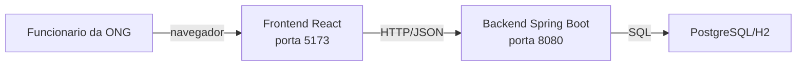

# C4 - Conteineres

## Componentes

### Frontend React

Responsabilidades:
- Interfaces do usuario para cadastro e consulta de produtos, doacoes e distribuicoes.
- Consumo das APIs do backend via HTTP/JSON.

Dependencias:
- Backend Spring Boot.

### Backend Spring Boot

Responsabilidades:
- Regras de negocio para produtos, distribuicoes e estoque.
- Exposicao das APIs REST e validacoes de entrada.

Dependencias:
- Banco de dados PostgreSQL/H2.

### PostgreSQL/H2

Responsabilidades:
- Persistencia de produtos, distribuicoes e registros relacionados.
- Suporte a consultas para calculo de estoque.

Dependencias:
- Acesso controlado pelo backend.

## Como a arquitetura apoia o MVP

A separacao entre frontend, backend e banco permite evolucao rapida do MVP: o frontend foca
na experiencia do usuario, o backend centraliza regras e validacoes, e o banco garante
persistencia confiavel. Essa divisao facilita testes, manutencao e futuras expansoes
sem alterar toda a aplicacao.