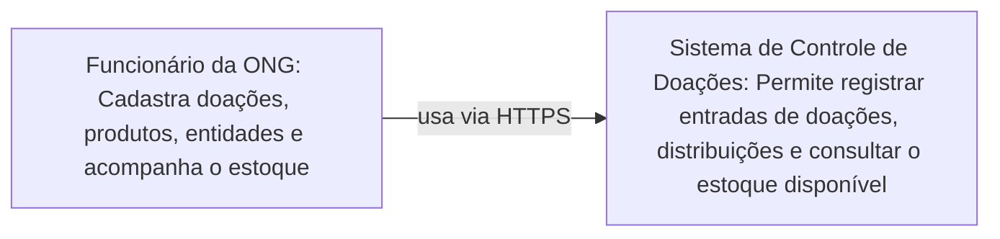

# C4 - Contexto

## Descricao

O diagrama de contexto apresenta o App de Doacao como uma caixa preta e o ator principal
(Funcionario da ONG), que utiliza o sistema para registrar doacoes, gerenciar produtos e
acompanhar distribuicoes e estoque.